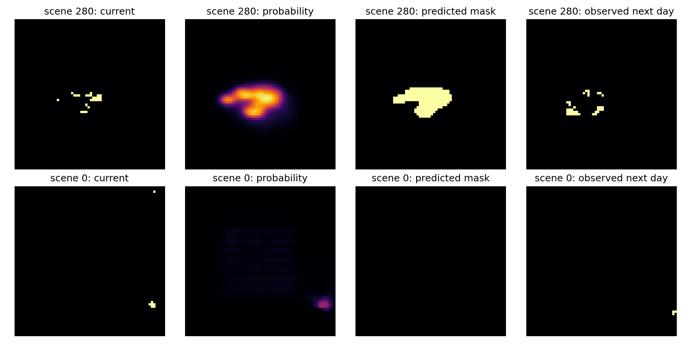

# Model user guide: what goes in and what comes out

Three selected models answer two disaster questions. Random Forest estimates
river discharge; XGBoost flags unusually high flow; U-Net maps next-day activity
around an existing wildfire. No landslide model passed the data-quality gate.
These are retrospective research models, not live official warning services.

## Quick start with real examples

Start in the repository root after obtaining the source and trusted artifacts as
described in [OWNER_INTEGRATION_HANDOFF.md](OWNER_INTEGRATION_HANDOFF.md).
`export_handoff.py` creates complete JSON examples from local held-out data; the
owner can receive its output directory without transferring all training data.

```powershell
.\.venv\Scripts\python.exe -m disaster_research.export_handoff
.\.venv\Scripts\python.exe -m disaster_research.inference disaster_research/artifacts/flood/selected_regression.joblib disaster_research/artifacts/handoff/random_forest_input.json
.\.venv\Scripts\python.exe -m disaster_research.inference disaster_research/artifacts/flood/selected_event.joblib disaster_research/artifacts/handoff/xgboost_input.json
```

The first command requires the original saved held-out flood table and wildfire
TFRecords. Skip that command on an inference-only machine with transferred JSONs.
The next two commands work with transferred artifacts and inputs. No credentials
or external weather calls are used in inference.

For U-Net, run this Python example from the repository root in the compatible
environment (the existing CLI above handles classical models only):

```python
import json
from pathlib import Path
from disaster_research.inference import predict_fire_map

root = Path("disaster_research")
payload = json.loads((root / "artifacts/handoff/unet_input.json").read_text())
checkpoint = root / "runs/wildfire/screening/dl/wildfire-screen-unet-b16-s42/best.pt"
result = predict_fire_map(checkpoint, payload)
assert result["status"] == "prediction", result
print(result["validation_alert_cutoff"])
print(len(result["uncalibrated_probability_map"]))  # 64 rows
reference = json.loads((root / "artifacts/handoff/unet_output.json").read_text())
import numpy as np
assert np.allclose(result["uncalibrated_probability_map"],
                   reference["uncalibrated_probability_map"], rtol=1e-5, atol=1e-6)
```

Do not run these loaders against user-uploaded artifacts.

### Actual exported flood example

For catchment `03005`, with input day 2013-12-31 and target day 2014-01-01,
the saved models returned:

| Output | Actual value |
|---|---:|
| RF `discharge_m3_s[0]` | 41.75717115160998 m3/s |
| XGBoost `probability[0]` | 0.00005828218411220035 (about 0.00583%) |
| XGBoost `exceeds_validation_alert_cutoff[0]` | false |

This is a deterministic first-row illustration, not evidence that all predictions
are accurate. The full input has every required feature; do not replace it with a
short made-up example. Dates use the documented retrospective convention.

## Common request metadata

| Key | Meaning and requirement |
|---|---|
| `prediction_time` | Timezone-aware ISO 8601 issue time |
| `latest_input_available_at` | Time when the latest required input became available; cannot exceed issue time |
| `latest_observation_time` | Latest required observation time; cannot follow availability or be over one day old at issue |
| `units_confirmed` | Must be `true`, AFTER checking source units; this does not perform conversion |

For historical flood examples, we assume an issue at midnight after input day t;
the target is source day t+1. That is a retrospective convention, not proof that
all inputs were published by midnight. Fire example dates are illustrative API-test
values only; they must not appear in the portal as true scene occurrence dates.
The real source arrays and model outputs are not synthetic.

## Model 1: Random Forest discharge

Question: "How much water will pass the catchment outlet tomorrow?"

Supply `rows`: a list of 1-4096 complete engineered feature dictionaries for a
supported catchment. A catchment is the drainage area, not an arbitrary map pin.
Keep `catchment_id` as a string with leading zeros, such as `03005`.
The exact feature list is read from the serialized artifact and exported to
`reports/model_handoff_manifest.json`. Do NOT send every column from the feature
table: `target_discharge`, `target_high_flow`, `split` and dates are not predictors.

| Feature group | Exact behavior |
|---|---|
| Current flow | `discharge`, in m3/s |
| Flow history | `discharge_lag_k = q[t-(k-1)]`, k = 1, 2, 3, 7, 14, 30. Legacy naming means lag_1 equals current q[t], NOT yesterday. Preserve this for existing weights. |
| Rain | `prcp(mm/day)` and `rain_sum_3`, `_7`, `_14`, `_30`: sums including day t and preceding days; summed unit mm |
| Temperature/humidity | `tavg(C)` in Celsius; `rel_hum(%)` in percent |
| Soil water | `sm_lvl1(kg/m2)` through `sm_lvl4(kg/m2)`, NOT percentage sensor moisture; layers 0-0.1, 0.1-0.35, 0.35-1 and 1-3 m |
| Trend | `discharge_trend_3 = q[t]-q[t-3]`, similarly 7; m3/s |
| Season | `season_sin/cos` use 2*pi*day_of_year/365.25 |
| Static attributes | Saved numeric topography, soil and geology columns; use the original catchment values and units, never approximate manually |

About 30 days of underlying observations are needed for these summaries. The
adapter takes the calculated row, not the 30-day raw table. `flood_data.py` is the
historical feature reference; it also constructs targets and is NOT a ready-made
live feature service. No tomorrow observations may be used to build inputs.

Output fields on success:

- `status: "prediction"`, `data_quality_status: "complete_research_inputs"`.
- `discharge_m3_s`: one nonnegative number per requested row, in row order.
- `model_version: "camels-ind-random_forest-reg-v2"`.
- `prediction_time`, `target_end` and `horizon: "one dataset day"`.
- `operationally_validated: false`.

It does not return a calibrated confidence interval, water level, flood depth or
inundation map. Do not show its number as centimetres or a percentage. Saved
preprocessing is applied internally; do not normalize inputs a second time.

## Model 2: XGBoost high-flow classifier

Use the same engineered input schema. Output fields match the common response,
but replace discharge with:

- `probability`: one validation-calibrated high-flow score per row.
- `exceeds_validation_alert_cutoff`: one Boolean per row.
- `model_version: "camels-ind-xgboost-event-v2"`.

Two thresholds must not be confused:

1. **Physical target threshold:** each catchment's training-only discharge q95.
   The predicted event is observed q[t+1] STRICTLY GREATER than this value.
   Obtain it from `reports/flood_catchment_audit.csv` column `train_q95_m3_s`,
   using ONLY the selected IDs in `reports/flood_dataset_audit.json`.
2. **Score cutoff:** flag when calibrated model score is >=
   `0.13507359650769765`. It was selected by validation F2, not by test tuning.

A score of 0.20 is above the cutoff; 0.08 is below. Those are explanatory numbers,
not recorded model outputs. 13.5% does not mean a 13.5% rise in water level, nor a
verified probability of inundation. The saved response does not include the cutoff
itself; the portal can read it from trusted artifact metadata/manifest.

Display "High-flow review flag" rather than "Flood confirmed" or "Safe". Changing
the score cutoff does not require retraining, but changes precision/recall. Changing
the discharge target definition requires new labels, training and evaluation.
RF and XGBoost can disagree; do not silently force their outputs to agree.

## Model 3: U-Net existing-fire spread

Supply `channels`, a dictionary of 12 raw, aligned 64x64 arrays. Each position is
the same geographic cell across every layer. Do not submit a JPEG or camera image.
The model looks at the neighborhood as well as each pixel's values.

| Channel key | Required dataset-native meaning/unit |
|---|---|
| `elevation` | metres |
| `pdsi` | drought index |
| `NDVI` | dataset's scaled vegetation index; not automatically 0-1 |
| `pr` | precipitation, mm/day |
| `sph` | specific humidity, kg/kg; not relative humidity percent |
| `th` | wind direction, degrees clockwise from north |
| `tmmn`, `tmmx` | minimum/maximum temperature, Kelvin; NOT Celsius |
| `vs` | wind speed, m/s |
| `erc` | supplied Energy Release Component index |
| `population` | people/km2 |
| `PrevFireMask` | -1 unknown, 0 inactive, 1 active; scene must contain known active fire |

All values must be finite and all shapes exactly 64x64. The adapter applies the
training normalization/clipping constants internally. Do not pre-normalize again.
Unknown current fire is represented by -1, not by replacing all environmental
missing values with -1. `FireMask`, the next-day observed target, is NEVER an input.

Output on success:

- `uncalibrated_probability_map`: 64x64 floating-point model scores.
- `validation_alert_cutoff`: approximately 0.4495303297 for selected seed 42.
- `model_version: "wildfire-screen-unet-b16-s42"`, common status/time/horizon fields.
- `operationally_validated: false`.

Create a displayed binary mask with `score >= validation_alert_cutoff`. Newly active
predictions are flagged cells with `PrevFireMask == 0`; exclude unknown current
cells from that analysis. The adapter does not return the binary mask or measured
warning lead time. A pixel score of 0.8 is NOT a validated 80% probability.



Top: median positive-scene IoU example. Bottom: lowest-IoU positive scene, with
ties resolved by scene order. Bright pixels are active/high-score; gray is unknown
where present. Scene IDs are dataset order, not locations. Neither mask is an exact
burned-area perimeter. Do not infer a GPS boundary from these arrays.

## Failures and safe presentation

For caught validation errors, adapters return `status: "insufficient_data"`,
`data_quality_status: "rejected"` and a `reason`, without a new risk prediction.
The UI should show the reason and not retain an old low-risk result as current.
Other model/runtime errors can still raise exceptions; a production wrapper must
handle them safely and check output finiteness.

The portal should always show "Historical research demo - not an official warning",
the dataset/model version, assumed or unavailable timing, and the example's data
quality. Precomputed output must say PRECOMPUTED; do not claim an inference request
ran if the backend simply served a saved file.
