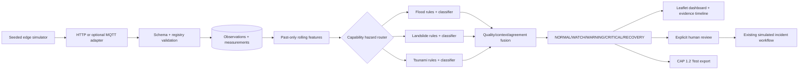

# Edge Early Warning

> **SIMULATED / DEMO ONLY. No real emergency notifications are sent.**

## What is implemented

The feature extends AapadSnehi’s current FastAPI, SQLAlchemy/SQLite, React and Leaflet application. It adds registry-aware simulated telemetry, normalized time-series storage, rolling features, independent flood/landslide/tsunami engines, evidence fusion, a hysteretic event policy, risk evidence and CAP test export. A reviewed event can create an `unverified`, `simulation`-provenance incident and then enter the existing priority, map and volunteer workflow. Public prototype routes have no authentication; promotion therefore requires explicit demo confirmation but is not presented as RBAC.



## One-command demo

Install dependencies once (`pip install -r backend/requirements.txt` and `npm install` in `web`), then from the product root:

```powershell
powershell -ExecutionPolicy Bypass -File .\scripts\start-edge-demo.ps1
```

Open `http://127.0.0.1:5173/edge-early-warning`. The script starts a six-device gradual-flood demonstration at 60x speed, about 75 seconds plus processing time. The UI can select all 11 scenarios, start, pause, resume, stop and reset runs. Reset retires the old virtual devices and closes their active event while retaining their evidence, then creates a deterministic fresh run. Direct CLI: `cd backend; python -m app.edge.simulator --scenario tsunami-seismic-001 --devices 6 --region odisha_coast --speed 60`.

## API

| Method | Route | Purpose |
|---|---|---|
| GET | `/api/edge/catalog` | profiles, properties, scenarios, regions and demo notice |
| POST/GET | `/api/edge/devices` | register/list devices |
| GET | `/api/edge/devices/{id}` | virtual-device registry view |
| POST | `/api/edge/telemetry` | validated HTTP fallback ingestion |
| GET | `/api/edge/observations/latest` | latest observation per device |
| GET | `/api/edge/devices/{id}/observations` | timestamped device history |
| GET | `/api/edge/risks?minLat=&minLon=&maxLat=&maxLon=` | latest risks in map bounds |
| GET | `/api/edge/events` and `/api/edge/events/{id}` | current events and full evidence/timeline |
| POST | `/api/edge/events/{id}/review` | acknowledge, dismiss or confirmation-gated promotion |
| GET | `/api/edge/events/{id}/cap` | CAP 1.2 XML with `Test` status |
| POST/GET | `/api/edge/simulations` | start/list deterministic runs |
| POST | `/api/edge/simulations/{id}/{pause|resume|stop|reset}` | control or deterministically restart a run |
| GET | `/api/edge/snapshot` | efficient two-second UI polling abstraction |

Interactive schemas and examples are at `/docs`.

## Scenario catalogue

Normal operation; gradual river flood; flash flood; rainfall-triggered landslide; slope movement without heavy rainfall; tsunami-like anomaly after a simulated seismic event; sensor failure; communication outage/recovery; false spike; conflicting sensors; and event recovery. Trends use seeded Gaussian noise, correlated channels, smooth/periodic changes, health loss and missing values. Duplicates and out-of-order packets are supported and tested at ingestion; durable replay and store-and-forward are next-phase work.

## Optional MQTT

Copy `.env.edge.example` values to the ignored `.env`, start `docker compose -f docker-compose.edge.yml up -d`, and set `AAPAD_EDGE_MQTT_ENABLED=true`. Publishers send the versioned JSON to `aapadsnehi/edge/<deviceId>/telemetry`; the broker adapter invokes the exact same validation/service pipeline as HTTP. The included anonymous broker binds for local demo convenience only.

To connect ESP32/Raspberry Pi later: register a stable ID and explicit capabilities, populate UTC timestamps/monotonic sequences and UUID message IDs, buffer QoS 1 packets locally, publish the contract above, retain server-side TLS/auth at the broker, and never include evaluation `groundTruthState` on real devices.

## State and alert policy

Risk is not raised from an isolated abnormal reading. Configured watch/warning/critical thresholds require consecutive assessments and, for critical state, nearby agreement; an explicit simulated extreme tsunami condition can escalate immediately. Exit thresholds are lower and require three windows, producing hysteresis and RECOVERY. Each event retains device/observation/assessment IDs, features, versions, quality, confidence, transition reasons and timestamps.

## Optional and future

- Optional now: local Mosquitto ingestion and lazy CPU Chronos residual experiment.
- Interface only: IMD, CWC and NOAA DART official corroboration; each requires a real credential/config/runtime verification gate before it can be labelled live.
- Future workers: Prithvi flood segmentation, Landslide4Sense and DeepSlide as satellite corroboration—not edge models.
- Next phase: authenticated operator RBAC, durable replay, calibrated field data, watershed/terrain topology, offline device queue, benchmark telemetry, SSE/WebSocket transport, signed CAP validation and external-provider provenance audits.

Primary references: [OGC SensorThings](https://www.ogc.org/standards/sensorthings/), [CAP 1.2](https://docs.oasis-open.org/emergency/cap/v1.2/CAP-v1.2-os.html), [IMD API](https://api.imd.gov.in/public/api_reference.html), [CWC flood forecasting](https://ffs.india-water.gov.in/), [NOAA DART](https://www.ncei.noaa.gov/products/natural-hazards/tsunamis-earthquakes-volcanoes/tsunamis/dart-ocean-bottom-pressure), [Prithvi](https://huggingface.co/ibm-nasa-geospatial/Prithvi-EO-2.0-300M-TL-Sen1Floods11), [Landslide4Sense](https://github.com/iarai/Landslide4Sense-2022), [DeepSlide](https://huggingface.co/harshinde/DeepSlide_Models).
