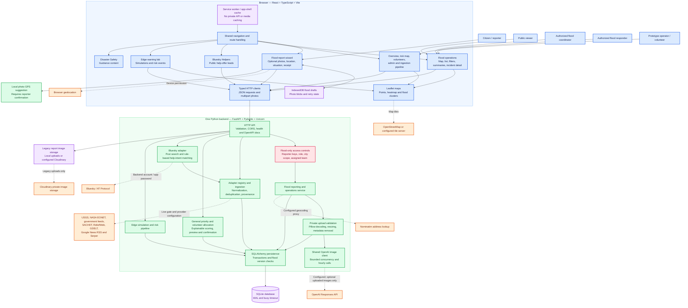
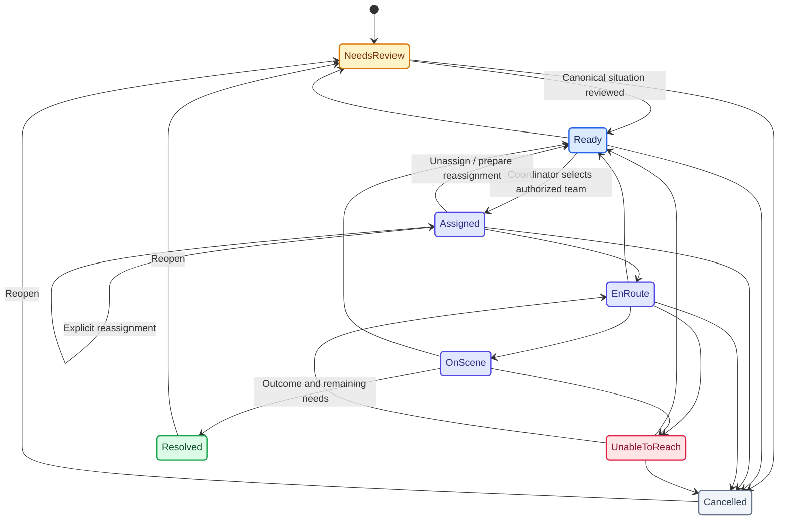
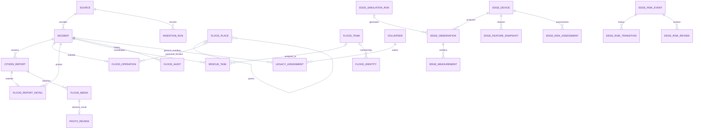
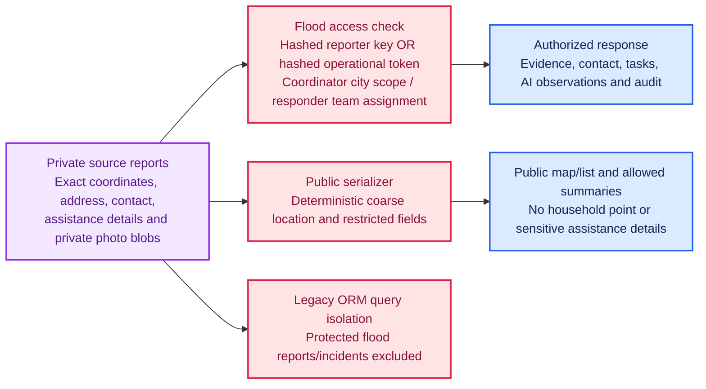
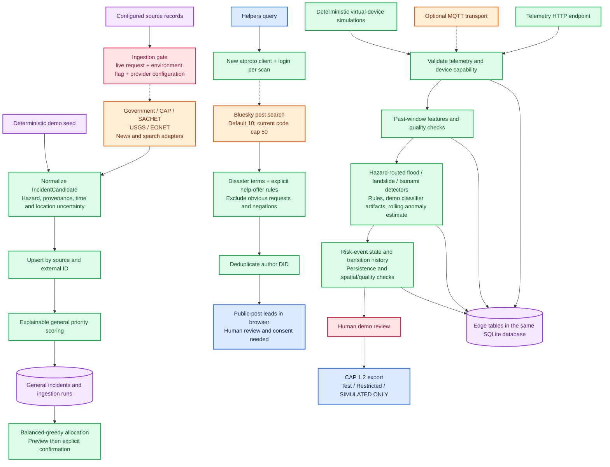
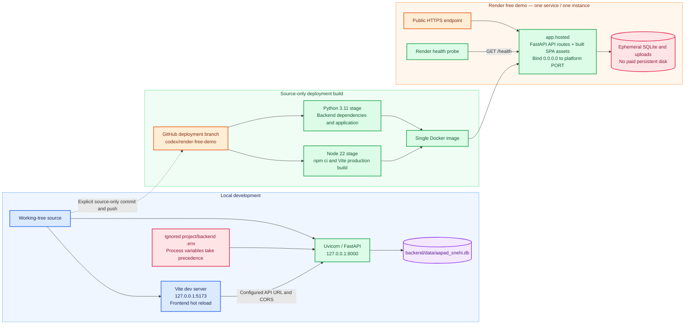

# AapadSnehi — Portal Architecture

Source-verified on **16 September 2026**. Scope: the current local `aapad-snehi/`
application, including the unified flood reporting and optional OpenAI photo review.
These Mermaid diagrams render in compatible Markdown viewers, including GitHub.

**Color key:** blue = browser/user interfaces; green = backend processing;
purple = storage; orange = external providers; rose = security/review boundaries.
Labels remain authoritative; colors are visual aids, not verification indicators.

**Reading guide:** solid arrows show implemented paths; dotted arrows show optional,
configuration-dependent connections. An implemented adapter does not imply a live,
configured or verified external service. The application is a **modular monolith**,
not a collection of separately deployed microservices.

## 1. Complete system overview



The Bluesky-to-ingestion connection represents the adapter's `fetch()` path.
The dedicated Helpers scan returns leads to the browser; it does **not** register
volunteers, create assignments, or maintain a persistent people database.

## 2. Routes and module ownership

| Browser route | Backend / data responsibility | Access boundary |
|---|---|---|
| `/` | `/api/dashboard`, general incidents, sources and assignments | Public prototype |
| `/map` | General incidents and heatmap | Public prototype; not validated flood extent |
| `/flood/report` | `/api/flood/reports`, receipt lookup, media upload | Creation is public; own-report access requires private reporter key |
| `/flood` | `/api/flood/incidents`, grouping, review, teams and tasks | Coarse public view; operational details require scoped credential |
| `/volunteers` | Volunteer registration, open tasks, claims, assignments | Public prototype, not flood responder authorization |
| `/admin` | Legacy moderation and allocation controls | Public prototype, not an authenticated administrator boundary |
| `/pipeline` | Sources, ingestion runs, live-request controls | Public prototype |
| `/bluesky-helpers` | `POST /api/bluesky/scan` | Public prototype endpoint; provider credentials remain server-side |
| `/edge-early-warning` | `/api/edge/*` | Simulated research/demo workflow, not production RBAC |
| `/safety` | Frontend guidance content | Public |

`/users`, `/user`, and `/report` normalize to `/flood/report` locally. The old
Users component and legacy report APIs remain in the source for compatibility;
Users is no longer a separate navigation entry. Browser requests use REST/HTTP,
not WebSockets or SSE. Flood operations refresh periodically (20 seconds);
the edge snapshot view polls every 2 seconds.

## 3. Citizen report, photo screening and rescue workflow

```mermaid
%%{init: {"theme":"base","themeVariables":{"actorBkg":"#DBEAFE","actorBorder":"#2563EB","actorTextColor":"#172554","actorLineColor":"#64748B","signalColor":"#334155","signalTextColor":"#172554","labelBoxBkgColor":"#DCFCE7","labelBoxBorderColor":"#16A34A","labelTextColor":"#14532D","loopTextColor":"#14532D","noteBkgColor":"#FEF3C7","noteBorderColor":"#D97706","noteTextColor":"#78350F","activationBkgColor":"#F3E8FF","activationBorderColor":"#9333EA"}}}%%
sequenceDiagram
    actor Citizen
    participant UI as Flood report wizard
    participant Draft as IndexedDB
    participant API as Flood API
    participant DB as SQLite
    participant AI as OpenAI (if configured)
    actor Coordinator
    actor Responder

    Citizen->>UI: Select report type; enter location and situation
    UI->>Draft: Save draft and optional compressed photos
    Note over UI,Draft: Offline drafts are not platform receipts
    Citizen->>UI: Confirm pin or supply textual description
    UI->>API: Submit text/location with idempotency key
    API->>DB: Save source report, operational incident and audit
    Note over API,DB: Rescue report also creates a needs-review task
    API-->>UI: Reference, server receipt and review/location status
    alt Optional photos attached
        loop Each photo, maximum four
            UI->>API: Upload photo with private reporter key
            API->>API: Decode actual image and strip derivative metadata
            API->>DB: Commit private media and pending photo review
            API->>AI: Screen derivative only, bounded to 25 seconds
            alt Screening succeeds
                AI-->>API: Caption and visible-evidence assessment
                API->>DB: Store private advisory result and audit
            else Missing config, error or timeout
                API->>DB: Store unavailable status; retain attached photo
            end
            API-->>UI: Attachment status and advisory screening result
        end
    else No photographs
        Note over UI,API: No AI request; report remains usable
    end
    UI->>Draft: Remove completed submitted draft
    Note over UI,Draft: Failed photo uploads remain available for explicit retry
    Coordinator->>API: Review evidence, clarify location, group reports
    API->>DB: Version-checked changes and audit trail
    Coordinator->>API: Set canonical situation, urgency and verification
    Coordinator->>API: Mark task ready; assign a scoped team
    Responder->>API: En route, on scene, outcome and remaining needs
    API->>DB: Persist task transitions and actor/timestamps
    Note over API,DB: Rescue completion does not automatically resolve flooding
```

Photo results are advisory, not authenticity checks or verified depth, headcount,
urgency, or dispatch decisions. Upload retries reuse the same photo hash per report
without repeating screening. A process interruption can leave screening pending:
there is no durable image-job queue or automatic recovery worker.

### Rescue task state machine



These are display labels for the backend states `needs_review`, `ready`, `assigned`,
`en_route`, `on_scene`, `unable_to_reach`, `resolved`, and `cancelled`. The backend
checks both allowed transitions and actor permissions; not every actor can take
every arrow. Task progress, flood status, verification, urgency, and observation
freshness are separate fields.

## 4. Data architecture and privacy boundary



This is a conceptual relationship diagram, not executable migration DDL. Flood
place memberships also live in report JSON; not every relationship is a SQL FK.
`PHOTO_REVIEW` maps to `flood_photo_reviews`, `RESCUE_TASK` to
`flood_rescue_tasks`, and `LEGACY_ASSIGNMENT` to `assignments`.



- Originals and display derivatives are private SQLite blobs in `flood_media`.
  Derivatives are resized JPEGs without photo metadata; this does **not** redact faces.
- Flood media requires reporter ownership or scoped operational access. Public
  publication is disabled. API responses use `Cache-Control: no-store`.
- Operational identity uses provisioned opaque tokens, not a portal-wide login or
  OAuth system. Stored credentials are hashes. No portal-wide RBAC is claimed.
- SQLite uses WAL and a busy timeout. Version-checked updates prevent silent
  concurrent changes to operational incidents/tasks. Startup creates missing tables
  and runs the existing additive compatibility/flood migrations; there is no Alembic service.

### Geographic aggregation

Reports retain original and normalized addresses, string door numbers, observation
times, coordinate source/accuracy/confirmation, and location-resolution state.
Places group locality, street, landmark and building identities; door numbers are
not globally unique. Unresolved textual reports remain visible without a fabricated point.

Backend incident filters also drive summaries. Reviewed canonical situations—not
the sum of every report—provide people counts. Exact, estimated, unknown and
responder-confirmed counts remain distinct; buildings and shared teams are deduplicated.
Conflicting evidence and stale observations remain visible. Grouping suggestions
require human review. Merges preserve source reports/history and explicitly handle tasks.

Map precision is limited: point clustering and street filters/group statistics exist;
automatic zoom-level locality/street/building summary switching is incomplete. The
map currently plots the returned page while summaries can cover all filtered matches.
There are no fabricated street flood boundaries or verified rescue routes.

## 5. External data, social leads and simulated edge warnings



**Current limits and non-connections:**

- Bluesky searches are read-only. Session reuse, shared caching, incremental scans,
  and application-level request budgets were discussed but are **not implemented**.
  The diagram intentionally shows login on each scan, not an optimized future design.
- Provider errors/configuration failures are surfaced, not replaced by fake live results.
  Demo examples remain separately labelled.
- The edge system is simulated decision support, not an official early-warning network.
  The default path uses rolling forecasting. A lazy optional Chronos adapter exists;
  its availability is not proof that it runs in the default pipeline.
- There is **no implemented real emergency SMS/email/push dispatch service**.
  CAP export and in-app status are not public emergency notification delivery.
- `blip-caption-api/` and `bluesky_test.ipynb` are historical experiments.
  The portal's active image client is **OpenAI**, not BLIP. An older Hugging Face
  client/configuration also exists but is not the active instantiated image provider.
- General volunteer assignments and protected flood rescue tasks are separate
  workflows even though they share the database. No automatic cross-assignment is implied.

## 6. Local development and hosted deployment



The prepared Docker configuration disables live adapters, MQTT and SACHET polling
by default. The source allowlist excludes local databases, uploads, credentials,
notebooks and Git metadata. A Docker `VOLUME` declaration is **not** a provisioned
Render persistent disk. Free-hosted reports can disappear on restart/redeploy and
idle instances can have slow cold starts.

The deployed demo is `https://aapad-snehi.onrender.com/`. The last deployment verified
in this task history used commit `df505be`; later local unified-report/photo-review
changes were not deployed. This document describes **local source architecture**,
not a claim that the hosted site is identical or that its current runtime was rechecked.

## 7. Source map and verification coverage

All paths below are relative to `aapad-snehi/` unless stated otherwise.

| Architecture area | Main source files |
|---|---|
| Navigation and client | `web/src/App.tsx`, `routes.ts`, `components/Shell.tsx`, `lib/api.ts` |
| Citizen reporting and offline drafts | `web/src/pages/FloodReportPage.tsx`, `lib/flood.ts`, `lib/photo-location.ts`, `web/public/sw.js` |
| Operational map and detail | `web/src/pages/FloodOperationsPage.tsx`, `components/FloodMap.tsx` |
| Main API and storage | `backend/app/main.py`, `config.py`, `database.py`, `models.py` |
| Protected flood domain | `backend/app/flood/routes.py`, `service.py`, `schemas.py`, `models.py`, `auth.py`, `migration.py`, `manage.py` |
| Photo screening | `backend/app/flood/photo_review.py`, `services/image_triage.py` |
| General ingestion / allocation | `backend/app/adapters/`, `services/ingestion.py`, `services/normalizer.py`, `priority.py`, `allocation/` |
| Bluesky Helpers | `backend/app/adapters/bluesky.py`, `services/social_intent.py`, `web/src/pages/BlueskyHelpersPage.tsx` |
| Edge warnings | `backend/app/edge/`, edge models in `backend/app/models.py`, `web/src/pages/EdgeEarlyWarningPage.tsx` |
| Hosting | `Dockerfile`, `.dockerignore`, `render.yaml`, `backend/app/hosted.py` |
| Tests | `backend/tests/`, frontend `*.test.ts`, `scripts/verify-flood-browser.py` |

The preceding implementation run passed 240 backend tests, 15 frontend tests and
the frontend build. Those are historical results, not a new test run for this document.
This documentation-only change was checked against current routes, imports, models,
service logic and deployment files. It neither contacts live providers nor changes
runtime behavior or deploys the application.
